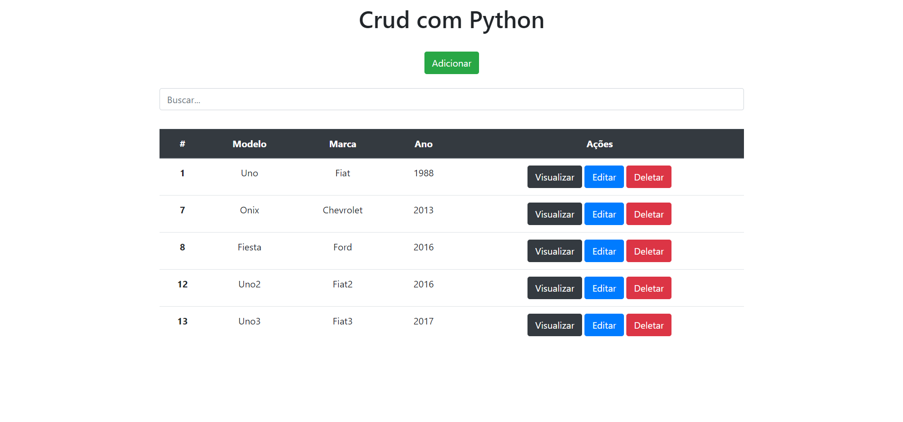

[](https://github.com/marioandre01)
[](#)
[](https://github.com/marioandre01/crud_python/stargazers)
[](https://github.com/marioandre01/crud_python/network/members)
[](https://github.com/marioandre01/crud_python/graphs/contributors)
[](https://github.com/marioandre01/crud_python/blob/master/LICENCE.md)


<h1 align="center">
    crud_python
</h1>

<p align="center"> 
  <a href="#-projeto">Projeto</a>&nbsp;&nbsp;&nbsp;|&nbsp;&nbsp;&nbsp;
  <a href="#-tecnologias">Tecnologias</a>&nbsp;&nbsp;&nbsp;|&nbsp;&nbsp;&nbsp;
  <a href="#-layout">Layout</a>&nbsp;&nbsp;&nbsp;|&nbsp;&nbsp;&nbsp;
  <a href="#bulb-funcionamento-da-aplicação">Funcionamento da aplicação</a>&nbsp;&nbsp;&nbsp;|&nbsp;&nbsp;&nbsp;
  <a href="#-executando-a-aplicação">Executando a aplicação</a>&nbsp;&nbsp;&nbsp;|&nbsp;&nbsp;&nbsp;
  <a href="#gear-contribuição">Contribuição</a>&nbsp;&nbsp;&nbsp;|&nbsp;&nbsp;&nbsp;
  <a href="#memo-licença">Licença</a>
</p>

## 💻 Projeto
Este projeto foi desenvolvido...

## 📋 Tecnologias

O projeto foi desenvolvido com as seguintes tecnologias:

- Python
- django
- SQLite
- BootStrap

## 🎨 Layout

<p align="center">
  
</p>

## 💻 Executando a aplicação

### Requisitos necessários

Para executar o projeto é necessário ter instalado em seu sistema:
- Python

### :octocat: Clonando o Repositório

```bash
$ git clone https://github.com/marioandre01/crud_python.git

# entre na pasta do projeto
$ cd crud_python

```
### 💻 Executando a aplicação

```bash
# Ativando o modo virtual
$ cd venv/Scripts

$ ./activate

# Será ativado o modo virtual, aparecerá um "(venv)" no inicio da linha de comando, ex:
$ (venv) PS E:\crud-python\venv\Scripts> 

# Voltar para a pasta principal
$ cd ../..

# executar a aplicação
$ python manage.py runserver

```

## :gear: Contribuição

Para contribuir com esse projeto faça os seguintes passos:

- Faça um fork desse repositório.
- Crie uma branch com a sua feature: 
```bash
git checkout -b minha_feature
```
- Faça um commit das suas modificações: 
```bash
git commit -m 'feat: Minha nova feature'
```
- Faça um push para a sua branch: 
```bash
git push origin minha_feature
```

## :memo: Licença

Esse projeto está sob a licença MIT. Veja o arquivo [LICENSE](./LICENSE.md) para mais detalhes.


